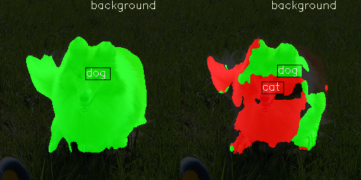
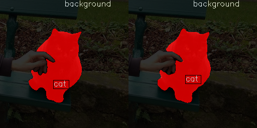
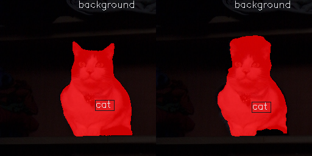
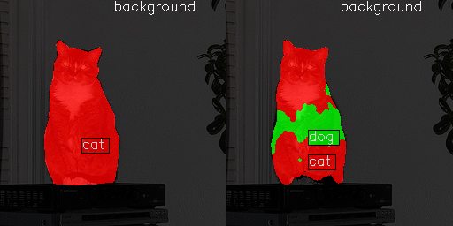
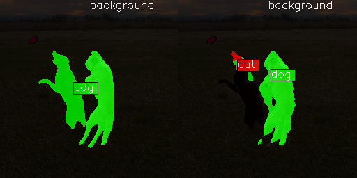
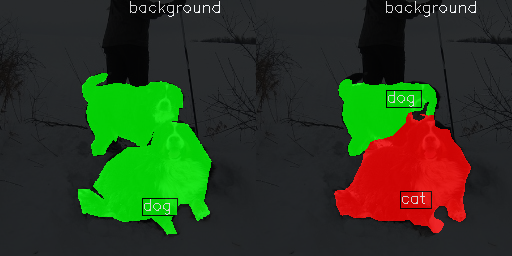
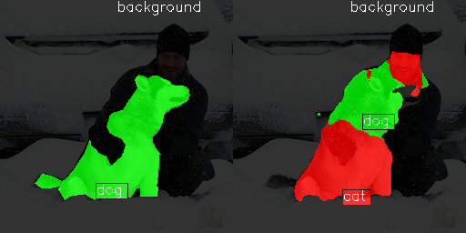
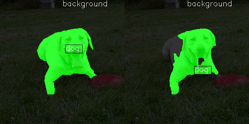
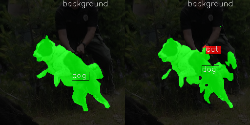

  
Отчет о проделанной работе в требуемом формате.      
  
Эксперименты в локально поднятом mlflow, так как clearml больше недоступен. Смотри результаты в practicum_work\mlflow    
пример как поднять: mlflow server --backend-store-uri sqlite:///mlflow/mlflow.db --default-artifact-root mlflow/artifact --host 127.0.0.1 --port 5000    
  
  
===============================================      
## Этап 1. Исследовательский анализ (EDA)    
===============================================      
    
Весь анализ провел в ноутбуке, потом дополнительно оформил основные части в отдельных py файлах.      
Для проверки масок написал код с интерактивной формой, которая по кнопкам перемещает изображение с маской либо в cleared, либо в err.      
Таким образом проверил вручную все маски.      
    
Результаты оценки распределения изображений:      
    practicum_work/artifacts/eda_results/dataset_statistics.csv      
Результаты оценки распределения классов:      
    practicum_work/artifacts/eda_results/class_distribution.csv      
Плюс то же на графике:      
    practicum_work/artifacts/eda_results/count_summary.png      
Примеры визуализации масок:      
    practicum_work/artifacts/eda_results/train_samples.png      
    practicum_work/artifacts/eda_results/test_samples.png      
    practicum_work/artifacts/eda_results/val_samples.png      
    
Вот такие изображения имеют некорректные маски (+на трех вообще нет кошек/собак).      
List of error masks images:      
  000000023731_404.jpg      
  000000028253_7169.jpg      
  000000066011_2187.jpg      
  000000066041_3589.jpg      
  000000121530_5761.jpg      
  000000148827_6207.jpg      
  000000149184_281.jpg      
  000000152588_3243.jpg      
  000000247301_4455.jpg      
  000000258305_3996.jpg      
  000000275028_3168.jpg      
  000000275919_4499.jpg      
  000000317781_4461.jpg      
  000000325768_1316.jpg      
  000000326073_4335.jpg      
  000000328760_6588.jpg      
  000000332844_1987.jpg      
  000000372709_3956.jpg      
  000000419618_7033.jpg      
  000000477647_5556.jpg      
  000000481212_908.jpg      
  000000562835_2386.jpg      
  000000562999_3786.jpg      
  000000574769_0.jpg      
    
    
Выводы:      
Во всех наборах все изобрадения имеют маски и наоборот. Распределение классов сбалансировано. Однако в train авторы задания подкинули явного мусора.      
    
    
===============================================      
## Этап 1. UPDATE: Доразметка данных      
===============================================      
    
Использовал для этого связку моделей YOLO и SAM      
Примеры визуализации масок после автоматической YOLO+SAM доразметки:      
    practicum_work/artifacts/eda_results/train_after_add_yolo_sam_labels_samples.png      
После доразметки снова провел ручную проверку. В итоге с 7 изображениями YOLO+SAM не справилась, я их отложил совсем. Остальные вернул в train с корректной разметкой.      
Cписок изображений с ошибками, которые так и не удалось разметить:      
  000000028253_7169.jpg      
  000000066041_3589.jpg      
  000000148827_6207.jpg      
  000000149184_281.jpg      
  000000419618_7033.jpg      
  000000477647_5556.jpg      
  000000574769_0.jpg      
  
UPDATE: после неудачных экспериментов далее вернулся к доразметке и с помощью roboflow доразметил оставшееся. На трех изображдениях нет кошек/собак - их убрал полностью  
    
===============================================      
## Этап 2. Формирование первичных гипотез      
===============================================      
    
Наборы сбалансированы, объекты по большей части хорошо различимы.      
По заданию нужно использовать mmsegmentation. Для начала возьму модель и параметры из теории спринта (fcn_unet_s5-d16)          
    
Начальные параметры:      
optimizer = dict(type='AdamW', lr=0.001, weight_decay=0.001) + PolyLR' до eta_min=1e-4    
    
аугментации для начала такие (как в примере в спринте)      
    dict(type='PhotoMetricDistortion'),    
    dict(type='RandomRotFlip', degree=(-45, 45)),    
    dict(type='RandomCutOut', prob=0.4, n_holes=(7, 15), cutout_ratio=(0.1, 0.15)), #, seg_fill_in=0    
    dict(type='Albu', transforms=[dict(type="GridDistortion", num_steps=10, p=1)]),    
    
Запуск обучения:    
python mmsegmentation/tools/train.py practicum_work/src/configs/unet1_conf.py --work-dir practicum_work/artifacts/mmsegmentation_work_dir    
    
Результаты первого теста:    
    
http://localhost:5000/#/experiments/1/runs/b0022307e4e14ef6a3c3e7192eb35bff/model-metrics    
эксперимент sprint6_unet_v1    
    
Обучение не стал завершать, даже на 200 эпохе видно, что все плохо. До 65-й эпохи вообще не находила котов/собак, потом нашла, но обучение очень нестабильно.    
    
===============================================      
## Этап 3. Эксперименты по улучшению качества      
===============================================      
  
########    
= sprint6_unet_v2    
########    
Метрики крайне низкие, поэтому поменяю параметры. Обычно лучше по одному за раз, но тут нет смысла. По одному буду менять на следующих этапах.      
- поправил размер изображений (все данные 256*256)    
- оставил только базовые аугментации    
    dict(type='PhotoMetricDistortion'),    
    dict(type='RandomRotFlip', degree=(-45, 45)),    
- уменьшил число эпох до 100 (в финальной версии подниму, а сейчас важно понять, учится ли модель вообще)    
- поменял параметры обучения для борьбы с нестабильностью модели:    
optimizer = dict(type='AdamW', lr=0.0005, weight_decay=0.01)    
param_scheduler = [
    dict(type='LinearLR', start_factor=0.1, begin=0, end=10, by_epoch=True), # Сначала прогрев   
    dict(type='PolyLR', eta_min=1e-5, power=0.9, begin=10, end=epoch_num, by_epoch=True) # Потом Poly    
]    
http://localhost:5000/#/experiments/2/runs/d214fb9a92b3484bbe668357abd77308/model-metrics    
модель на 100й эпохе имеет по метрикам 0, остановил. Что то явно не так    
  
########    
= sprint6_unet_v3    
########    
поднял lr=0.01    
http://localhost:5000/#/experiments/3/runs/5be2ad9c6c054c1e86bb6233a2158463/model-metrics    
модель что то нашла, но особо не помогло    
  
########    
= sprint6_unet_v4    
########    
решил поменять оптимизатор на SGD:    
optimizer = dict(type='SGD', lr=0.01, momentum=0.9, weight_decay=0.0005)    
optim_wrapper = dict(type='OptimWrapper', optimizer=optimizer)    
param_scheduler = [ dict(type='PolyLR', eta_min=1e-5, power=0.9, begin=0, end=epoch_num, by_epoch=True)]    
и поднял число эпох, даже для теста лучше больше    
lr: 1.0000e-05  eta: 0:00:00  time: 0.1729  data_time: 0.0063  memory: 4413  loss: 0.2263  decode.loss_ce: 0.    
+------------+-------+-------+     
|   Class    |  Dice |  Acc  |    
+------------+-------+-------+    
| background | 96.68 | 98.42 |    
|    cat     | 50.94 | 41.64 |    
|    dog     | 43.28 | 39.01 |    
+------------+-------+-------+    
aAcc: 92.2100  mDice: 63.6300  mAcc: 59.6900  data_time: 0.0264  time: 0.0827  
http://localhost:5000/#/experiments/4/runs/2ca106ea646a4dba8fc42b87a98fb215    
стало неплохо находить кошек/собак, уже маленькая победа! Но метрики все равно ниже требуемых, а классы перепутаны    
    
вроде mDice неплохой, но не на кошках/собаках.    
видно, что все перепутано.    
    
########    
= sprint6_unet_v5    
########    
Попробовал бороться с дисбалансом (фон находить легко и модель умеет это делать прекрасно): поменял функцию потерь на FocalLoss + поднял loss_weight:    
http://localhost:5000/#/experiments/5/runs/878287b27da543d3a112d62ef8e41e21/model-metrics    
  Лучшая версия была с mDice примерно около 65, но кошек/собак все еще плохо находит, например:    
+------------+-------+-------+    
|   Class    |  Dice |  Acc  |    
+------------+-------+-------+    
| background | 96.52 | 97.55 |    
|    cat     | 52.86 | 49.05 |    
|    dog     | 45.63 | 40.38 |    
+------------+-------+-------+    
    
########    
= sprint6_unet_v6    
########    
Так как изменение CE на FocalLoss особо ничего не дало, вернул обратно CE.    
Эксперимент 6 аналогичен sprint6_unet_v4, но поднял только loss_weight=4.0 для борьбы с дисбалансом    
Кроме того, решил теперь стартовать с весов от предыдущей модели  
ничего это не дало...    
http://localhost:5000/#/experiments/6/runs/c8aa16ad4c9f4509929733d5c0431711    
    
  
########    
= sprint6_unet_v7    
########    
стартовал с v5 для ускорения  
вернулся к идее с focal loss, но увеличил gamma и уравнял вес FocalLoss и DiceLoss    
http://localhost:5000/#/experiments/7/runs/fd17702dffde4e06b02f9ff66626aea4      
метрики пляшут около 0.67, но не растут дальше    
Модель переобучается - метрики на трейне падают, а на валидации нет    
Далее попробую разные варианты, включая разные loss, поменять оптимизатор, weight_decay, аугментации и т.д.     
  
########    
= sprint6_unet_v8    
########    
Добавил веса для классов alpha=[0.1, 0.45, 0.45] в FocalLoss    
http://localhost:5000/#/experiments/8  
  
  
########    
= sprint6_unet_v9    
########    
вернулся к оптимизатору AdamW: optimizer = dict(type='AdamW', lr=0.001, weight_decay=0.001)  
и в этот раз обучился с нуля  
http://localhost:5000/#/experiments/9  
  
  
########    
= sprint6_unet_v10    
########     
обучился с нуля  
поправил weight_decay=0.1    
поправил аугментации:  
    dict(type='PhotoMetricDistortion'),  
    dict(type='RandomRotFlip', degree=(-20, 20)),  
    dict(type='RandomCutOut', prob=0.4, n_holes=(7, 15), cutout_ratio=(0.1, 0.15)), #, seg_fill_in=0  
    dict(type='Albu', transforms=[dict(type="GridDistortion", num_steps=10, p=0.33)]),  
http://localhost:5000/#/experiments/10  
Модель совсем не нашла собак - видимо аугментации нужны попроще  
  
  
########    
= sprint6_unet_v11    
########     
Решил вернуться к модели из эксперимента 7, но поменял SGD на AdamW    
Стартовал для ускорения с лучших весов из эксперимента 7    
очень странно, что при старте метрики значительно хуже, чем в конце последнего эксперимента. Не могу это понять...  
http://localhost:5000/#/experiments/11  
не знаю в чем дело, но модель снова разъехалась - метрики низкие...  
  
  
########    
= sprint6_unet_v12    
########     
стартовал из результатов модели 7, но снизил lr  
optimizer = dict(type='SGD', lr=0.0005, momentum=0.9, weight_decay=0.0005)  
также убрал в отдельной ветке RandomRotFlip, чтобы проверить, влияет ли это на что то (не влияет)    
http://localhost:5000/#/experiments/12  
Лучше не стало, хотя и хуже тоже.  
  
  
########    
= sprint6_deeplabv3_unet_s5_v1   
= sprint6_deeplabv3_unet_s5_v2    
########     
попытался поменять модель на deeplabv3_unet_s5  
http://localhost:5000/#/experiments/13  
http://localhost:5000/#/experiments/16  
Не смог настроить, вернулся к fcn_unet_s5-d16.py  
  
########    
= sprint6_unet_v15  
########     
стартовал для ускорения с ранее полученных весов (модель v12), но добавил максимально много аугментаций, также менял параметры в попытках побороть переобучение  
http://localhost:5000/#/experiments/15  
тут провел много экспериментов в попытках хоть немного улучшить  
Вот один из последних показательных примеров при сложных аугментациях + dict(type='AdamW', lr=0.0002, weight_decay=0.3)  
http://localhost:5000/#/experiments/15/runs/9eee8c30c93f4beb9594da487779b907  
видно, что модель переобучилась: mDice на val не растет, а вот loss на train все время падает.  
Добился максимум mDice=70, но дальше метрики не растут  
UPDATE: доразметил данные и это помогло на несколько процентов поднять mDice в несколько экспериментов  
Финальная версия описана в разделе Этап 4.  
http://localhost:5000/#/experiments/20/runs/47ee69cbe96e48b6b1038ae19051c46e/model-metrics  
  
########    
= segformer_b0_v1  
########     
Попробовал эту модель. В теории о ней не рассказывали, но это транформер с вниманием и он должен быть лучше для разделения кошек/собак    
Плюс эта модель даже легче unet, а значит на маленьком наборе меньше шансов переобучиться    
Попробовал для начала AdamW с маленьким lr  
аугментации разнообразные из максимального варианта unet  
Функцию потреь CrossEntropyLoss с весами + DiceLoss  
upd: Поменял CE на FocalLoss  
upd: менял lr и  weight_decay для борьбы с переобучением, добавлял и убирал аугментации.  
Максимум на этой модели mDice=64  
Пример эксперимента:  
http://localhost:5000/#/experiments/17/runs/187f8b69d8874b679c602e069b1144b9/model-metrics  
проблема та же: переобучение, на трейне метрики растут, на валидации - нет.  
Максимум mDice=65  
  
  
=======================================================  
## Этап 4. Заключение и выбор лучшего эксперимента     
=======================================================  
Оставил в итоге модель fcn_unet_s5-d16.py. При тестах для ускорения я обычно стартовал с весов предыдущего шага, но тут обучился с нуля.  
http://localhost:5000/#/experiments/20/runs/47ee69cbe96e48b6b1038ae19051c46e  
  
###########  
= финальные метрики:  
###########  
Iter(train)  
    lr: 9.0360e-05  
    eta: 0:17:15  
    time: 0.1847  
    data_time: 0.0062  
    memory: 4436  
    loss: 0.0081  
    decode.loss_focal: 0.0014  
    decode.loss_dice: 0.0068  
    decode.acc_seg: 98.6462  
  
Iter(val)  
    aAcc: 93.9500  
    mDice: 73.4900  
    mAcc: 70.8300  
    data_time: 0.0086  
    time: 0.0658  
  
+------------+-------+-------+  
|   Class    |  Dice |  Acc  |  
+------------+-------+-------+  
| background | 97.46 | 98.42 |  
|    cat     | 63.94 | 55.92 |  
|    dog     | 59.09 | 58.16 |  
+------------+-------+-------+  
  
###########  
= финальные параметры:  
###########  
Функция потерь:  
loss_decode=[  
dict(type='FocalLoss', loss_name='loss_focal', use_sigmoid=True, gamma=3.0, loss_weight=1.0),  
dict(type='DiceLoss', loss_name='loss_dice', loss_weight=1.0)  
]  
  
Расписание:  
optimizer = dict(type='AdamW', lr=0.0002, weight_decay=0.05)  
optim_wrapper = dict(type='OptimWrapper', optimizer=optimizer)  
param_scheduler = [ dict(type='PolyLR', eta_min=1e-6, power=0.9, begin=0, end=epoch_num, by_epoch=True) ]  
  
Аугментации:  
dict(type='LoadImageFromFile'),  
dict(type='LoadAnnotations'),  
dict(type='RandomFlip', prob=0.4, direction='horizontal'),  
dict(type='RandomRotate', prob=0.4, degree=(-30, 30)),  
dict(type='PhotoMetricDistortion',  
brightness_delta=15,  
contrast_range=(0.9, 1.1),  
saturation_range=(0.9, 1.1),  
hue_delta=5),  
dict(type='Albu', transforms=[dict(type="GridDistortion", num_steps=10, p=0.1)]),  
dict(type='PackSegInputs')  
  
###########  
= Примеры работы модели:  
###########  
на валидации (Для инференса на тесте сделал test_dataloader = val_dataloader)  
$ python mmsegmentation/tools/test.py practicum_work/src/configs/unet1_conf.py practicum_work/artifacts/mmsegmentation_work_dir/best_mDice_epoch_final.pth --out practicum_work/artifacts/inference_final/val_res  
+------------+-------+-------+  
|   Class    |  Dice |  Acc  |  
+------------+-------+-------+  
| background | 97.46 | 98.42 |  
|    cat     | 63.94 | 55.92 |  
|    dog     | 59.09 | 58.16 |  
+------------+-------+-------+  
04/10 18:04:48 - mmengine - INFO - Iter(test) [15/15]    aAcc: 93.9500  mDice: 73.4900  mAcc: 70.8400  data_time: 1.5712  time: 1.6879  
  
    
  
  
  
  
на тесте  
$ python mmsegmentation/tools/test.py practicum_work/src/configs/unet1_conf.py practicum_work/artifacts/mmsegmentation_work_dir/best_mDice_epoch_final.pth --out practicum_work/artifacts/inference_final/test_res  
+------------+-------+-------+  
|   Class    |  Dice |  Acc  |  
+------------+-------+-------+  
| background |  97.8 | 98.49 |  
|    cat     | 62.33 | 53.78 |  
|    dog     | 60.48 | 62.72 |  
+------------+-------+-------+  
04/10 17:50:37 - mmengine - INFO - Iter(test) [15/15]    aAcc: 94.3000  mDice: 73.5400  mAcc: 71.6700  data_time: 1.5760  time: 1.6949  
  
    
    
  
    
  
  
###########  
= Выводы:  
###########  
Основная проблема набора - он очень маленький. Плюс кошки/собаки занимают малую его часть.  
  
Функция потерь включает DiceLoss + FocalLoss с высоким gamma=3.0. Это помогает бороться с тем, что модель быстро находит фон и предсказывает только его. Ведь кошки и собаки занимают малую часть изображений, и без фокальной потери модель просто игнорирует их.  
  
Аугментации помогают бороться с маленьким набором и переобучением. Пришлось отказаться от RandomCutOut и RandomCrop - они ухудшали качество, так как объекты и так слишком маленькие.  
  
Низкое значение lr с постепенным уменьшением позволяет сначала быстро выучить фон, а потом аккуратно дообучаться на мелких объектах без риска испортить уже выученное. PolyLR плавно снижает lr к концу обучения, что помогает модели не перепрыгивать через оптимальные значения.  
  
В итоге модель все равно переобучается. Я остановил ее на 290 эпохе, так как дальше хоть лосс на трейне и падает, но на валидации метрика не растет. Это явный признак переобучения - модель запоминает шумы тренировочной выборки вместо обобщения.  
  
Одна из выявленных проблем при визуальном анализе: cat и dog модель часто путает друг с другом. Это связано с тем, что при разрешении 256x256 и малом количестве примеров сложно научиться различать мелкие детали вроде формы ушей или морды. По сути модель научилась находить "какое-то животное", но не всегда понимает, кошка это или собака.  
  
При таком маленьком размере объектов это близко к потолку возможностей. Для улучшения качества нужно больше данных или предобучение на более крупном наборе.  
  

=============================
## Этап 5. Документация кода
=============================
```  
practicum_work  
├── src  
│   ├── eda  
│   │   ├── notebook.ipynb   
│   │   │   - Jupyter ноутбук с исследовательским анализомОстальные скрипты его дублируют   
│   │   ├── add_labels_yolo_sam.py   
│   │   │   - добавляет метки к данным, размеченным с помощью YOLO и SAM  
│   │   ├── conf.py   
│   │   │   - настройки для EDA (пути, параметры)  
│   │   ├── data_filter.py   
│   │   │   - фильтрует данные по разным критериям (качество, размер и т.д.)  
│   │   ├── eda_base.py   
│   │   │   - основной скрипт для разведочного анализа данных (статистика, графики)  
│   │   ├── interactive_check_first.py   
│   │   │   - интерактивная проверка исходных данных  
│   │   ├── interactive_check_after_yolo_sam.py   
│   │   │   - интерактивная проверка данных после разметки YOLO+SAM   
│   │   ├── visualize_samples_with_masks.py   
│   │   │   - отрисовка примеров с масками (для визуального контроля)
│   │   ├── coco_to_png.py   
│   │   │   - конвертирует разметку из формата COCO в PNG-маски (для разметки после roboflow)   
│   │  
│   └── configs  
│       ├── animals_ds_conf.py   
│       │   - конфигурация датасета с животными  
│       ├── segformer_b0_conf.py   
│       │   - конфигурация модели SegFormer B0  
│       ├── unet1_conf.py   
│       │   - конфигурация модели U-Net  
│       └── bad_tests/   
│           - папка с неудачными/экспериментальными конфигами deeplab   
│  
├── artifacts  
│   ├── eda_results/   
│   │   - результаты разведочного анализа (графики, статистики)  
│   ├── inference_final/   
│   │   - финальные предсказания модели на тесте и валидации  
│   └── mmsegmentation_work_dir/   
│       - рабочая директория mmsegmentation (логи, чекпоинты)  
│  
└── mlflow/   
    - эксперименты MLflow (логирование метрик, параметров)  
└── data/   
    - все данные  
```